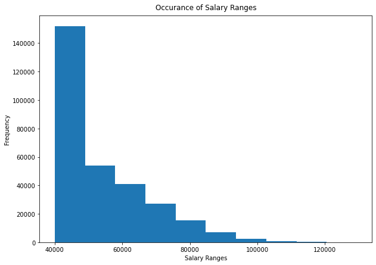
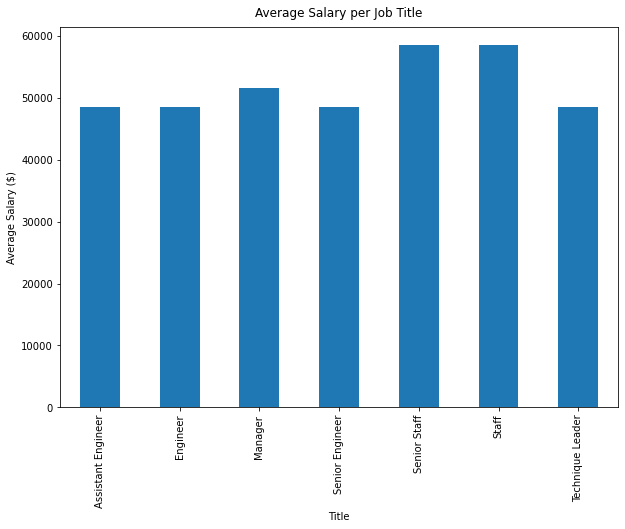

# sql-challenge

## Introduction

This is my submission for the SQL Challenge homework.


## Structure
```
|_EmployeeSQL
	|_Employee.sql  #db intialisation and queries
	|_QuickDBD-Employess ERD.png  #image of ERD
	|_QuickDBD-Employess ERD.sql  #schemata
	|_departments.csv
	|_dept_emp.csv
	|_dept_manager.csv
	|_employees.csv
	|_salaries.csv
	|_titles.csv
|_Graphs
	|_barchart
	|_histogram
|_.gitignore
|_Employee Summary.ipynb  #notebook of analysis
|_README.md

```


## Usage

```
python 3.8.5
pandas 1.2.4
matplotlib 3.3.4
sqlalchemy 1.4.7
postgresql 13

# a username and password is required for postgres in the juptyer notebook

```


## Summary

Each data analysis question is answered with the following views:
1. employee_salaries
2. employees_1986
3. managers
4. department_employees
5. hercules
6. sales
7. sales_development
8. employee_count


The histogram of salaries shows a typical distribution in an organisation where the lower salary ranges are more frequent:




The bar chart however shows that the average salaries are higher for staff and senior staff compared to managers which is not typical and indicates the data has been falsified:




The name associated with the employee number 499942 is April Foolsday which proves that this was a hilarious prank by some dad who thinks he's funny.
